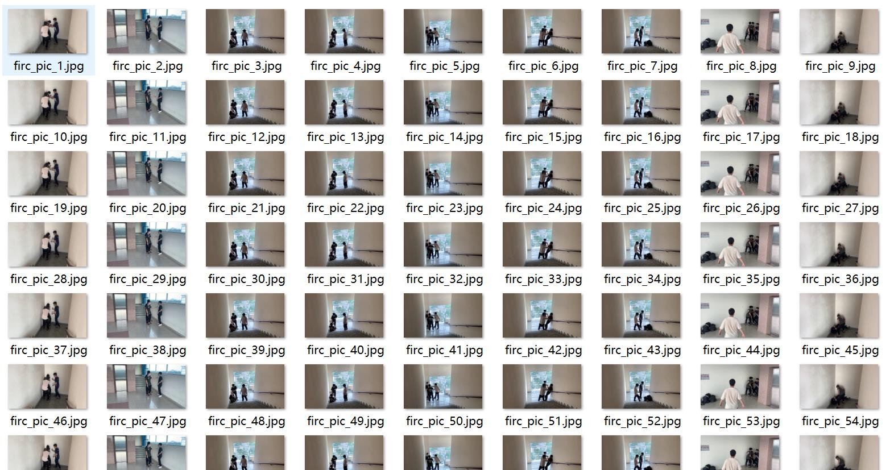
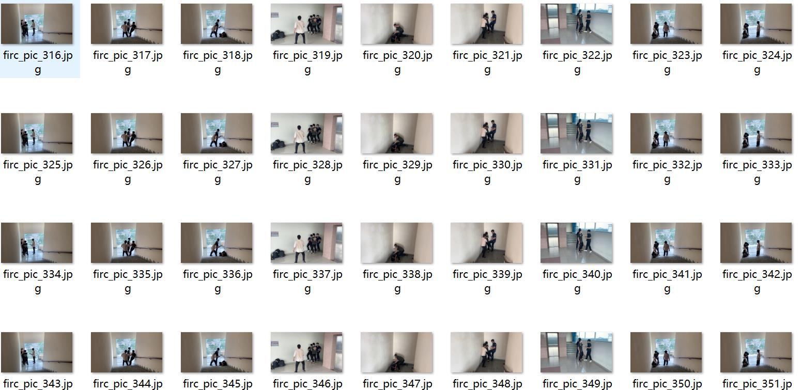
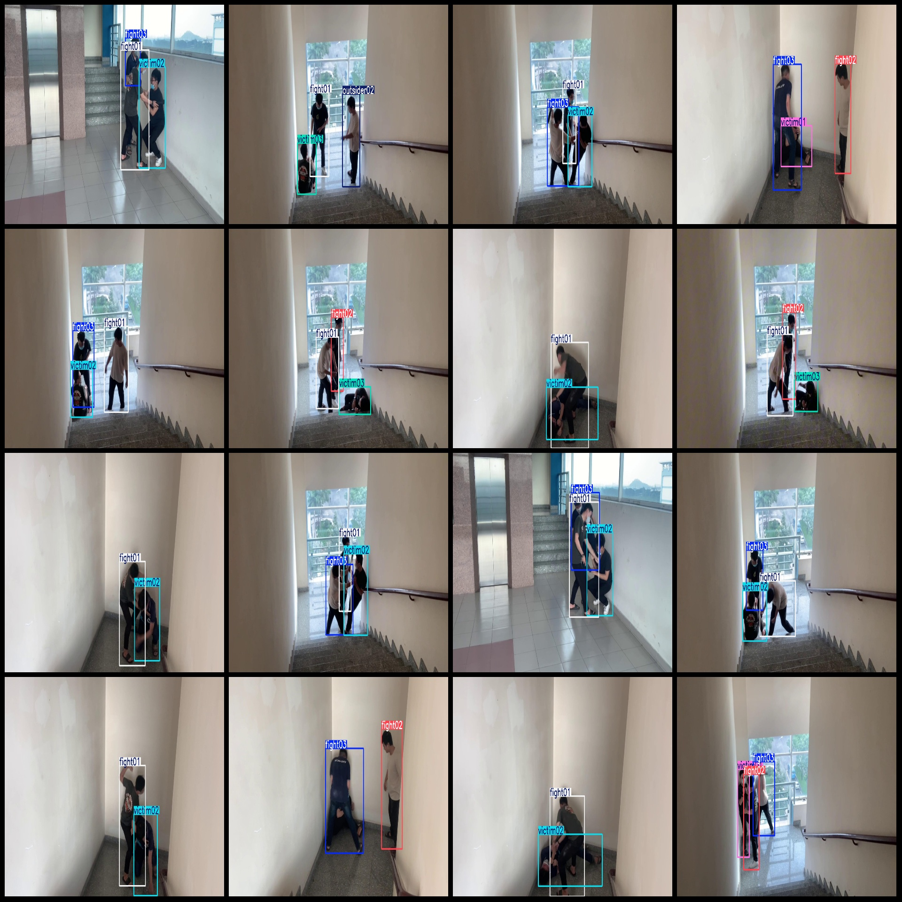
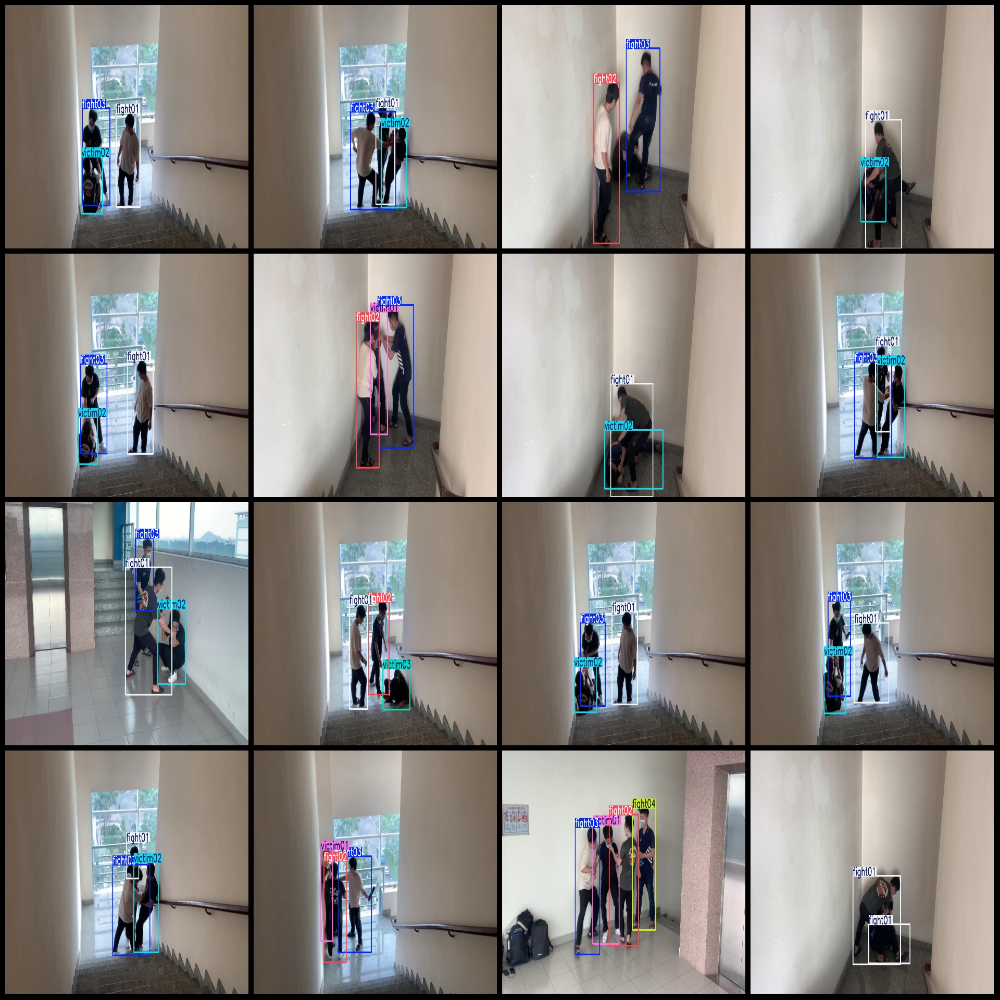

# Campus Violence Detection Dataset VOC+YOLO Format with 3827 Images in 10 Categories

The dataset contains 3827 images in Pascal VOC format and YOLO format, with 10 categories. The images are all extracted from multi-frame videos, so they may appear to have many duplicates. However, 
these are actually consecutive frames and not duplicates.

The dataset is organized as follows:
- JPG files (jpg)
- VOC format (xml) files
- YOLO format (txt) files

The number of images (jpg files) is 3827.
The number of annotations (xml files) is 3827.
The number of annotations (txt files) is 3827.
The number of categories is 10.
The names of the categories are ["fight01", "fight02", "fight03", "fight04", "outsider01", "outsider02", "outsider03", "victim01", "victim02", "victim03"].

Each category has a different number of bounding boxes (boxes). For example:
- fight01 has 2484 boxes
- fight02 has 1599 boxes
- fight03 has 2240 boxes
- fight04 has 119 boxes
- outsider01 has 195 boxes
- outsider02 has 546 boxes
- outsider03 has 253 boxes
- victim01 has 1059 boxes
- victim02 has 1637 boxes
- victim03 has 799 boxes

Total box count is 10931.

The number of images per category is different. For example:
- fight01 has 2470 images
- fight02 has 1597 images
- fight03 has 2238 images
- fight04 has 119 images
- outsider01 has 195 images
- outsider02 has 546 images
- outsider03 has 253 images
- victim01 has 1052 images
- victim02 has 1633 images
- victim03 has 799 images

The image resolution is 1920x1080.

The annotation tool used is labelImg.
Annotation rules are to draw bounding boxes for each category.

Important note: The dataset does not divide into training, validation, and test sets, so you need to do that yourself.

Special note: This dataset does not guarantee any accuracy for the trained models or weights file.

Image preview:
## Image

Here is a pay link on Stripe ( https://buy.stripe.com/3cs8yP7sY87d0vu9AB ). Please contact me lonlonago@foxmail.com after funding $89, and I will send you a complete data files , thank you!

